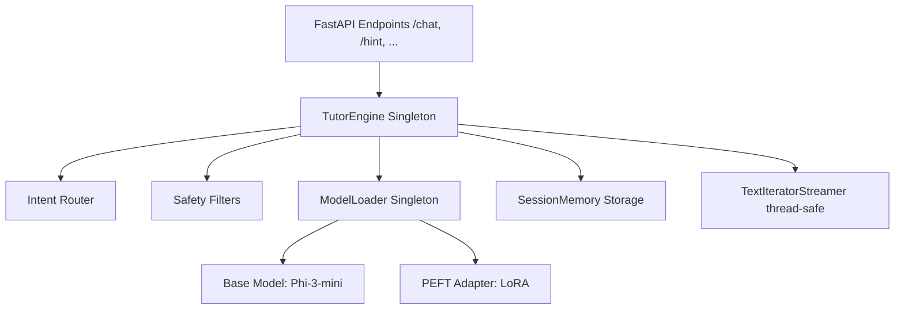

# DSA Tutor Production Inference Documentation

This document describes the design, configuration, architecture, loading sequence, and deployment guidelines for the production inference stack of the DSA Tutor system.

---

## 1. System Architecture

The DSA Tutor inference architecture is built for performance, memory efficiency, thread safety, and pedagogical safety on CPU and GPU environments.



- **ModelLoader (Singleton)**: Responsible for dynamically discovering configurations, loading tokenizer and base weights exactly once, attaching the LoRA adapter, validating architectural alignment (vocabulary, hidden dimension, target projection projection modules), and performing warmup queries.
- **TutorEngine**: The orchestrator. Directs incoming queries to specific tutor modes via intent routing, runs prompt injection filters, coordinates memory contexts, and schedules thread-safe generation.
- **SessionMemory**: Tracks history and session state variables (topics, difficulty, hints given, common student mistakes).
- **TextIteratorStreamer**: Employs non-blocking background threads to pull output tokens dynamically for streaming responses.

---

## 2. Model Loading and Validation Sequence

When the server starts up or queries the engine for the first time, it performs the following verification steps:

```
[Discovery] Read configs/inference.yaml and models/adapters/dsa_tutor_v1/adapter_config.json
     │
     ▼
[Tokenizer Initialization] Instantiate AutoTokenizer with trust_remote_code=False
     │
     ▼
[Base Model Load] Load microsoft/Phi-3-mini-4k-instruct (in bfloat16 for CPU efficiency)
     │
     ▼
[Compatibility Check] Verify:
     ├── Vocab size match (Tokenizer len vs Model config)
     ├── Hidden dimension matches (3072 for Phi-3)
     └── LoRA target projection modules exist in the loaded model
     │
     ▼
[Peft Adapter Bind] Attach LoRA adapters to projection layers
     │
     ▼
[Warmup Check] Execute a single dummy token inference sequence to initialize tensors
```

If any compatibility check fails, the loader immediately raises an `AssertionError` with diagnostic outputs to prevent corrupted outputs in production.

---

## 3. Configuration (`configs/inference.yaml`)

All parameters are retrieved dynamically from `configs/inference.yaml`. No names or values are hardcoded in the codebase.

```yaml
model:
  base_model: "microsoft/Phi-3-mini-4k-instruct"
  adapter_path: "./models/adapters/dsa_tutor_v1"
  torch_dtype: "bfloat16"

inference:
  max_new_tokens: 512
  temperature: 0.3
  top_p: 0.95
  top_k: 50
  do_sample: true
  stop_sequences:
    - "<|end|>"
    - "<|im_end|>"
    - "</s>"

server:
  host: "127.0.0.1"
  port: 8000
  workers: 1
```

---

## 4. API Reference and Examples

Start the FastAPI application:
```bash
python scripts/serve.py
```

### POST `/chat`
General tutoring conversation.

**Request**:
```json
{
  "session_id": "session_123",
  "query": "Can you explain how search operations work in a BST?"
}
```

**Response**:
```json
{
  "session_id": "session_123",
  "tutor_mode": "beginner_tutor",
  "topic": "Trees",
  "response": "**[Beginner Tutor]**\n\n### Concept & Explanation\nLet's imagine we have a phone book..."
}
```

### POST `/hint`
Requests hints without exposing code solutions.

**Request**:
```json
{
  "session_id": "session_123",
  "query": "Give me a hint on how to reverse a linked list."
}
```

**Response**:
```json
{
  "session_id": "session_123",
  "tutor_mode": "hint_generator",
  "topic": "Linked Lists",
  "response": "**[Hint Generator]**\n\n### Concept & Explanation\nHint 1: Think about storing pointer states..."
}
```

### GET `/health`
Returns runtime resource consumption, model hash, adapter details, and hardware status.

**Request**:
```bash
curl http://127.0.0.1:8000/health
```

**Response**:
```json
{
  "status": "ok",
  "tutor_engine_loaded": true,
  "base_model": "microsoft/Phi-3-mini-4k-instruct",
  "adapter": "./models/adapters/dsa_tutor_v1",
  "tokenizer": "microsoft/Phi-3-mini-4k-instruct",
  "device": "cpu",
  "memory_usage_mb": 7954.21,
  "load_status": "complete",
  "model_hash": "a4d3e8...",
  "adapter_hash": "2f6c91...",
  "available_modes": [
    "beginner_tutor",
    "interview_coach",
    "debugging_mentor",
    "complexity_analyst",
    "code_reviewer",
    "hint_generator"
  ]
}
```

---

## 5. Production Deployment Guide

1. **Environment Setup**:
   Ensure virtual environment dependencies are installed:
   ```bash
   pip install -r requirements.txt
   ```
2. **Execution Command**:
   Configure Python search path and run the FastAPI server:
   ```powershell
   $env:PYTHONPATH="C:\Users\Web-wizrd\Desktop\Github\LLM-Dataset-Training"
   python scripts/serve.py
   ```
3. **Verify Deployment**:
   Run the regression test suite:
   ```powershell
   python tests/test_tutor_api.py
   ```
