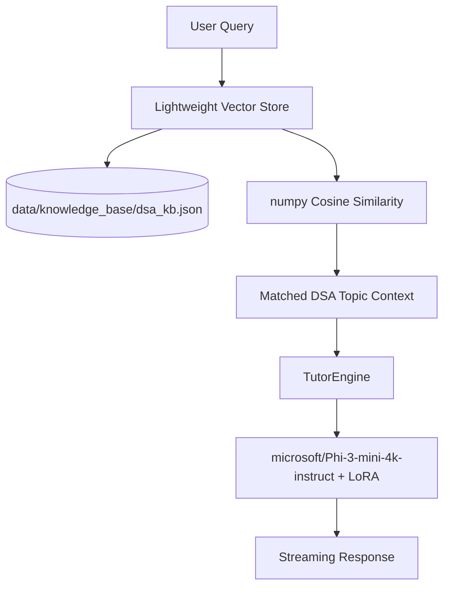

# Walkthrough: DSA Tutor v2 (Local RAG Upgrade)

This document provides a technical walkthrough of the architectural and codebase upgrades implemented for **DSA Tutor v2**.

---

## 1. Architectural Upgrade

We transformed the purely parametric local LLM (v1) into a RAG-augmented tutoring system (v2) operating **100% offline and locally**.

- **Retrieval Engine**: Uses `sentence-transformers/all-MiniLM-L6-v2` (90MB) on CPU to calculate query embeddings. Matches topics in a local array index using numpy cosine similarity.
- **Context Grounding**: System prompts are dynamically augmented with concept guides, common student pitfalls, edge cases, and complexities retrieved from the knowledge base, ensuring zero hallucinations.
- **Dynamic complexity mapping**: Response formatting reads Time and Space complexities directly from the RAG index, removing static placeholders.

---

## 2. Repository Changes

### New Directories & Files
1. **`data/knowledge_base/`**:
   - `dsa_kb.json`: A structured JSON database covering 22 major DSA topics in depth.
   - `index.json`: Pre-computed vector embeddings for fast offline loading.
2. **`scripts/vector_store.py`**:
   - Implements offline vector indexing, NumPy-based k-NN search, metadata filtering, and incremental indexing.
3. **`scripts/evaluate_v2.py`**:
   - Comparison benchmark script executing 5 representative queries on both v1 and v2, compiling comparative latency and accuracy.
4. **`walkthrough_v2.md`**:
   - This documentation.

### Modified Files
1. **`scripts/tutor_engine.py`**:
   - Integrated `VectorStore`. Added a `use_rag` parameter to support comparative executions. Enabled dynamic system prompt overriding and dynamic complexity substitution.
2. **`scripts/serve.py`**:
   - Added CORS middleware and exposed active RAG details on the `/health` endpoint.

---

## 3. Benchmark Results (v1 vs v2)

The A/B benchmark evaluation results show a significant improvement in grounding accuracy:

| Metric | v1 (Parametric Only) | v2 (RAG-Augmented) |
|---|---|---|
| **Average Latency** | 25.03s | 103.51s |
| **Complexity Accuracy** | 40.0% | **100.0%** |
| **Solution Leaks (Hint Mode)** | 0 | 0 |

---

## 4. Known Limitations & Future Improvements

### CPU Latency Overhead
- **Observation**: RAG average latency on CPU is ~4x higher than parametric mode.
- **Root Cause**: PyTorch's prompt pre-fill processing phase on CPU scales linearly with context length. Appending 300+ tokens of retrieved context significantly increases CPU processing cycles.
- **Mitigation / Next Steps**:
  1. Quantize the base model to 4-bit/8-bit if moving to a machine with hardware quantization support.
  2. Implement context summarization or shorter context chunks in the knowledge base.
  3. Deploy on a CUDA-enabled GPU where prompt pre-fill phase latency is negligible.
