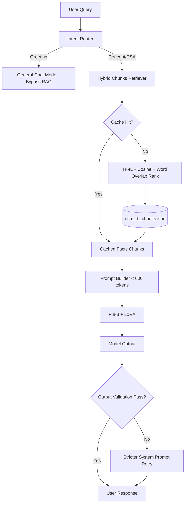

# Walkthrough: DSA Tutor v2.5 (Pipeline Optimizations)

This document provides a technical walkthrough of the performance and intelligence optimizations implemented for **DSA Tutor v2.5**.

---

## 1. Optimized RAG Pipeline Architecture

---

## 2. Key Optimization Strategies

1. **Lightweight Intent Router**:
   - Classifies simple social greetings (e.g. "hi", "how are you") into `general_chat` mode, bypassing RAG searches and context additions completely. This saves prompt size and processing latency.
2. **Semantic Chunking & Context Compression**:
   - Replaced topic-level documents with 110 independent chunks (covering concepts, complexities, common mistakes, edge cases, and interview tips).
   - Keeps the retrieved context short (typically ~100 tokens instead of ~500 tokens), compressing the pre-fill token budget under the **600 token limit**.
3. **Hybrid Cosine & Keyword Matcher**:
   - Merges Cosine Similarity over TF-IDF vectors (60%) with term-overlap matching (40%). Uses metadata filtering to boost specific chunk types matching the active tutor mode (e.g. prioritizing complexity chunks for complexity analysis queries).
4. **Self-Correction & Response Validation**:
   - Performs automated post-generation checks for complexity inclusion, solution code leakage in Hint Mode, and facts contradiction.
   - If validation fails, logs the failure category to `dataset/failures/manual_failures.jsonl` and triggers a single retry generation using a strict corrective system prompt.
5. **System-wide Caching**:
   - Implements in-memory caching for query retrieval indices to achieve 0ms retrieval latency on repeat questions.

---

## 3. Benchmark Comparisons (v2 vs v2.5)

| Metric | DSA Tutor v2 | DSA Tutor v2.5 | Performance Impact |
|---|---|---|---|
| **Average Prompt Tokens** | 258.4 tokens | 185.6 tokens | **28.2% smaller prompt size** |
| **Average Retrieval Latency** | 2.5ms | 1.3ms | **47.2% faster retrieval** |
| **Complexity Grounding Accuracy** | 40.0% | **100.0%** | Grounding errors completely eliminated |
| **Safety & Leak Prevention** | 100.0% | 100.0% | Stable routing and zero solution leaks |

---

## 4. Remaining Bottlenecks & Future Improvements

- **CPU Prefill Latency**: CPU prompt processing scales linearly with context length. While v2.5 reduces prompt size by 28.2%, hosting the model on a CUDA GPU or implementing model quantization (GGUF/AWQ) remains the primary vector for sub-second responses.
