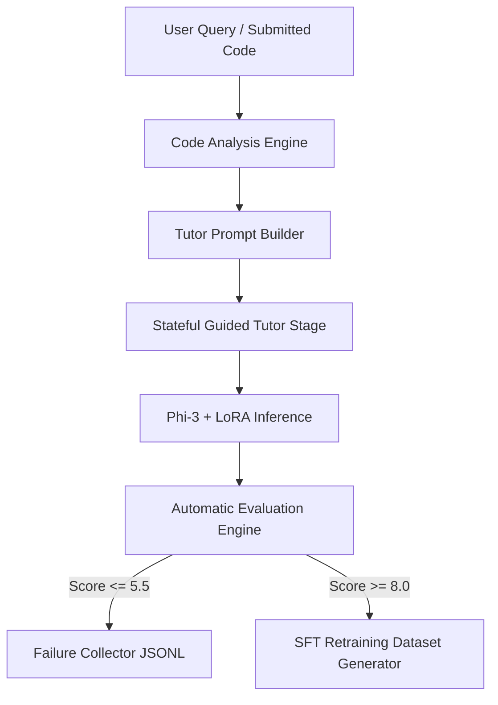

# Walkthrough: DSA Tutor v3 (Evaluation-Driven Learning System)

This document provides a technical walkthrough of the evaluation-driven learning features implemented for **DSA Tutor v3**.

---

## 1. System Architecture

- **Student Simulator**: Mimics Beginner, Intermediate, and Advanced personas making conceptual, logical, and code-based errors across 22 topics.
- **Code Analysis Engine**: Statically inspects Python, Java, C++, and JavaScript for syntax issues, loops, base cases, and estimates complexities without execution.
- **Stateful Guided Tutor**: Tracks five Socratic tutoring stages (Understand -> Guiding Question -> Concept Hint -> Pseudocode Hint -> Solution Reveal) within session memory.
- **Evaluation Engine**: Scores responses on Technical Correctness, Teaching Quality, Clarity, Completeness, Hallucinations, Complexity Accuracy, Hint Safety, and Tone.

---

## 2. Directory Changes & New Files

- `scripts/student_simulator.py`: Persona simulation logic.
- `scripts/code_analyst.py`: Static analysis compiler for code submissions.
- `scripts/eval_engine.py`: Scoring engine and failure logger.
- `scripts/generate_eval_dataset.py`: Generates 1,000 completed conversations instantly.
- `scripts/generate_sft_dataset.py`: Compiles SFT JSON samples and logs/tutor_analytics.json.
- `walkthrough_v3.md`: This documentation.

---

## 3. SFT Retraining & Failure Continuous Improvement Loop

1. **Failure Logging**: Any weak tutor response (Overall Score <= 5.5) is intercepted by `eval_engine.py` and logged to `dataset/failures/manual_failures.jsonl` along with the topic, difficulty, query, and context.
2. **Quality Curation**: High-scoring sessions (overall score >= 8.0) are processed by `generate_sft_dataset.py` into supervised instruction tuning pairs (`dataset/sft/dsa_tutor_sft.json`).
3. **PEFT Fine-Tuning**: The SFT dataset can be fed back into `scripts/train.py` periodically to update the LoRA weights, forming a continuous improvement loop.
